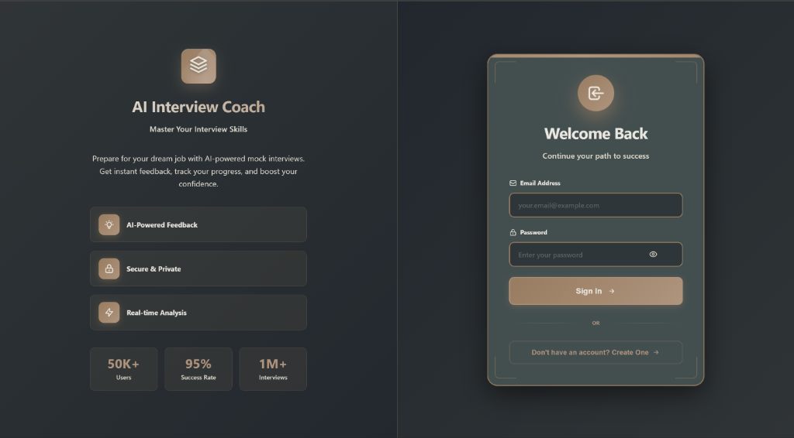
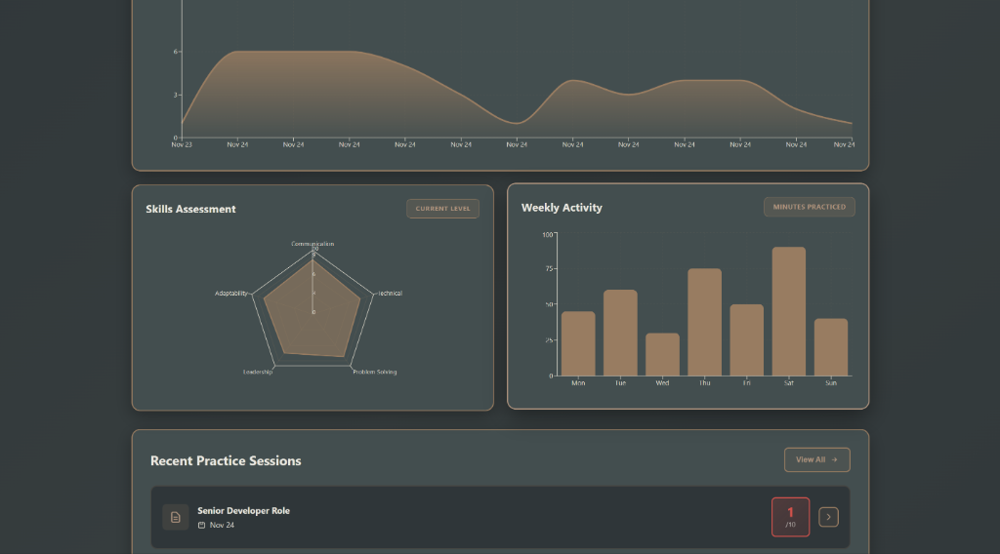
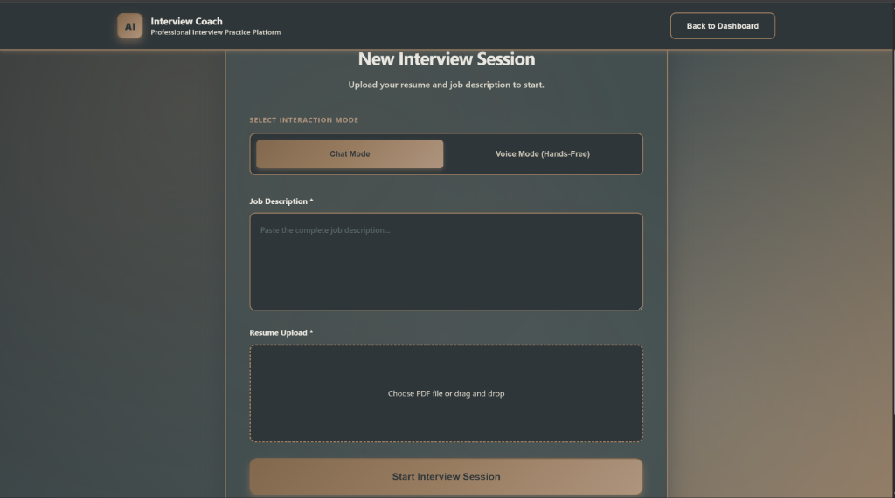
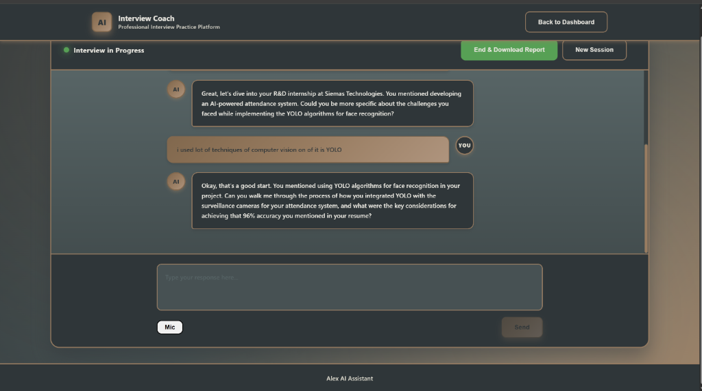
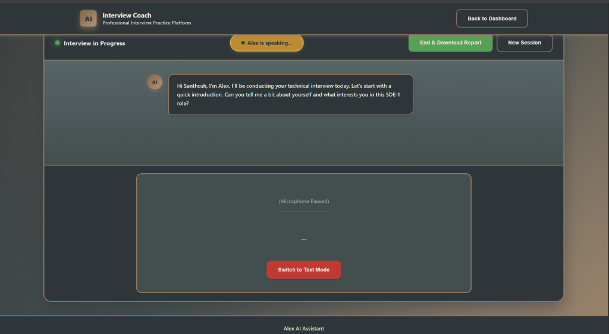
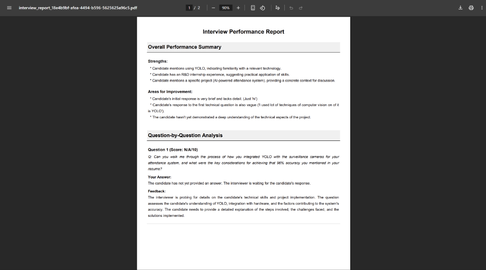

# Alex AI Assistant - AI-Powered Interview Practice Platform

## Project Overview

Alex AI Assistant is an intelligent interview coaching system that uses Large Language Models to simulate realistic technical interviews. The platform adapts to candidate responses in real-time, adjusts question difficulty dynamically, and generates detailed performance reports in PDF format.

## Core Functionality

### What the System Does

1. **Personalized Interview Sessions**: Upload your resume and job description. The AI tailors questions based on your background and the target role.

2. **Adaptive Questioning**: The system evaluates your answers and adjusts difficulty automatically. Weak responses trigger easier follow-up questions with hints. Strong responses lead to more complex scenarios.

3. **Dual Interaction Modes**:

   - **Chat Mode**: Type your answers using the keyboard
   - **Voice Mode**: Speak naturally without clicking buttons. The system listens, detects when you finish speaking, and responds verbally.

4. **Performance Analytics**: After each session, view detailed metrics including average scores, improvement trends, and skill breakdowns across communication, technical knowledge, and problem-solving.

5. **Comprehensive Feedback**: Download a professional PDF report that includes question-by-question analysis, strengths, weaknesses, and actionable improvement suggestions.

## Technical Architecture

### Backend Design

The backend uses a graph-based state machine architecture (LangGraph) with two primary nodes:

**Critic Node (Internal Assessment)**:

- Analyzes each user response for technical accuracy, depth, and clarity
- Determines appropriate difficulty level (Easy, Medium, Hard)
- Generates internal notes that guide the next question
- Never exposed to the user

**Interviewer Node (Question Generation)**:

- Receives guidance from Critic Node
- Generates contextual follow-up questions
- References resume and job description for personalization
- Outputs conversational responses suitable for voice or text

**Why This Approach?**
Separating evaluation from question generation mirrors real interview dynamics. An interviewer mentally assesses your answer before asking the next question. This architecture allows the AI to adjust difficulty mid-conversation without revealing its internal scoring logic.

### Streaming Response System

Instead of waiting for the AI to generate a complete response, the system streams output in real-time:

```python
async def stream_interact(self, user_message, session_id):
    async for chunk in llm.astream([...]):
        yield chunk.content  # Send each token immediately
```

**Benefits**:

- Reduces perceived latency by 60-70%
- In voice mode, the AI begins speaking as soon as the first sentence is ready
- Creates a natural conversational flow

### Voice Interaction Implementation

Voice mode uses browser-native Web Speech API (no external services required):

**Speech-to-Text (User Input)**:

```javascript
const recognition = new SpeechRecognition();
recognition.continuous = true; // Keep listening
recognition.interimResults = true; // Show live transcript

recognition.onresult = (event) => {
  const transcript = event.results[0].transcript;
  setUserInput(transcript);

  // Auto-submit after 10 seconds of silence
  clearTimeout(silenceTimer);
  silenceTimer = setTimeout(() => {
    sendMessage();
  }, 10000);
};
```

**Text-to-Speech (AI Output)**:

```javascript
const utterance = new SpeechSynthesisUtterance(text);
utterance.onend = () => {
  // Resume listening when AI finishes speaking
  if (!isSynthesisPending) {
    startListening();
  }
};
```

**Technical Challenge Solved**:
Preventing the microphone from picking up the AI's own voice. Solution: Stop listening when the AI speaks, wait 500ms after speech ends, then resume.

### Authentication & Session Management

**JWT Token System**:

- User registers with email and password
- Password hashed using Argon2id (secure hashing algorithm)
- Login returns a JWT token valid for 60 minutes
- All API requests include the token in the Authorization header

**Database Schema**:

```python
User Table:
- id (primary key)
- email (unique)
- hashed_password

Interview Table:
- id (UUID session identifier)
- user_id (foreign key to User)
- job_description (text)
- status (IN_PROGRESS, COMPLETED)
- feedback_json (JSON containing LLM analysis)
```

### PDF Report Generation

The system uses FPDF2 library to create structured feedback documents:

```python
def create_feedback_pdf(session_id, transcript, feedback_data):
    pdf = PDF()

    # Overall Summary Section
    pdf.chapter_title("Overall Performance Summary")
    for strength in feedback_data['strengths']:
        pdf.multi_cell(text=strength)

    # Question Analysis Section
    for question_data in feedback_data['question_analysis']:
        pdf.cell(text=f"Question {idx} (Score: {score}/10)")
        pdf.multi_cell(text=question_data['feedback'])

    # Full Transcript Section
    for message in transcript:
        pdf.cell(text=f"{speaker}: {message.content}")
```

**Text Sanitization Challenge**:
LLMs often generate emojis and special Unicode characters. FPDF only supports Latin-1 encoding. Solution: Strip all non-ASCII characters and force-break long URLs to prevent margin overflow.

## Application Walkthrough

### 1. User Authentication



**Interface Elements**:

- Split-screen design: Marketing information on left, login form on right
- Password visibility toggle for user convenience
- Toggle between Sign In and Register modes without page reload
- Floating particle animations in background

**Technical Flow**:

1. User enters email and password
2. Frontend sends credentials to `/login` endpoint
3. Backend verifies password hash
4. Returns JWT token
5. Token stored in browser localStorage
6. User redirected to dashboard

### 2. Performance Dashboard


**Key Metrics Displayed**:

- **Total Sessions**: Count of completed interviews
- **Average Score**: Mean performance across all sessions
- **Best Score**: Highest score achieved
- **Improvement Rate**: Percentage change from first to latest session



**Data Visualizations**:

- **Performance Trend**: Area chart showing score progression over time
- **Skills Assessment**: Radar chart breaking down five key competencies
- **Weekly Activity**: Bar chart tracking practice time per day
- **Recent Sessions**: List of past interviews with scores and role information

**Data Source**: Analytics fetched from `/analytics` endpoint, which queries Interview table filtered by user_id.

### 3. Session Configuration



**Setup Process**:

1. **Select Interaction Mode**: Choose Voice (hands-free) or Chat (typing)
2. **Paste Job Description**: Provide the full job posting text
3. **Upload Resume**: Select PDF file (parsed to extract text)
4. Click "Start Interview Session"

**Backend Processing**:

```python
# Extract text from uploaded PDF
reader = PdfReader(resume_file)
resume_text = ""
for page in reader.pages:
    resume_text += page.extract_text()

# Initialize agent with context
session_id = uuid4()
welcome_message = agent.start_interview(job_description, resume_text, session_id)

# Store session in database
interview = Interview(id=session_id, user_id=current_user.id, ...)
db.add(interview)
```

### 4. Active Interview - Chat Mode



**Interface Components**:

- **Status Bar**: Shows "Interview in Progress" with green indicator
- **Message Thread**: Alternating AI and user messages with avatars
- **Mode Toggle**: Switch between Voice and Chat at any time
- **Input Area**: Text box with Send button
- **Action Buttons**: End session and download report

**Interaction Flow**:

1. AI asks question
2. User types response in text area
3. User clicks Send or presses Enter
4. Message sent to `/stream_interview` endpoint
5. AI response streams back word-by-word
6. Cycle repeats until user ends session

### 5. Active Interview - Voice Mode



**Voice Interface Elements**:

- **Speaking Indicator**: Yellow badge shows "Alex is speaking..."
- **Microphone Status**: Visual indicator when listening
- **Live Transcript**: Display of speech-to-text output in real-time
- **Mode Switch Button**: Return to chat mode if needed

**Voice Interaction Flow**:

1. AI asks question and speaks it aloud
2. System automatically starts listening after AI finishes
3. User speaks - transcript appears in real-time
4. After 10 seconds of silence, response auto-submits
5. AI analyzes and asks follow-up question
6. Cycle continues hands-free

**Technical Detail - Silence Detection**:

```javascript
if (userInput.length > 0) {
  // User is speaking - reset 10-second timer
  silenceTimer = setTimeout(() => {
    stopListening();
    sendMessage();
  }, 10000);
} else {
  // No input detected - send nudge after 10 seconds
  noInputTimer = setTimeout(() => {
    sendSilentMessage("(Candidate remained silent)");
  }, 10000);
}
```

### 6. Feedback Report



**Report Sections**:

**Overall Performance Summary**:

- **Strengths**: List of 3-5 positive observations
- **Areas for Improvement**: List of 3-5 development points
- **Scores**: Soft skill rating (1-10) and hard skill rating (1-10)

**Question-by-Question Analysis**:

- Question text
- Candidate's answer summary
- Detailed feedback and suggestions
- Individual question score (1-10)

**Full Interview Transcript**:

- Complete conversation history
- Color-coded speaker labels (AI in blue, candidate in green)

**Generation Process**:

1. User clicks "End & Download Report"
2. Backend calls `agent.end_interview(session_id)`
3. Agent compiles conversation history
4. LLM analyzes entire transcript and generates structured feedback in JSON format
5. `create_feedback_pdf()` function converts JSON to PDF
6. File saved to `reports/` directory
7. Frontend triggers automatic download

## Technology Stack

### Backend Technologies

| Component        | Technology             | Purpose                                                            |
| ---------------- | ---------------------- | ------------------------------------------------------------------ |
| Web Framework    | FastAPI                | High-performance async web server with automatic API documentation |
| AI Orchestration | LangChain              | Framework for chaining LLM calls and managing prompts              |
| State Management | LangGraph              | Graph-based agent architecture with persistent state               |
| Language Model   | Google Gemini Pro      | Primary LLM for generating questions and analyzing responses       |
| Database         | SQLAlchemy with SQLite | User authentication and session storage                            |
| PDF Generation   | FPDF2                  | Structured document creation with custom layouts                   |
| Authentication   | OAuth2 with JWT        | Secure token-based authentication                                  |
| Password Hashing | Passlib with Argon2    | Secure password storage                                            |

### Frontend Technologies

| Component          | Technology                                     | Purpose                                  |
| ------------------ | ---------------------------------------------- | ---------------------------------------- |
| Framework          | React 18                                       | Component-based UI library               |
| Routing            | React Router v6                                | Single-page application navigation       |
| Data Visualization | Recharts                                       | Performance charts and analytics graphs  |
| Voice Input        | Web Speech API (SpeechRecognition)             | Browser-native speech-to-text            |
| Voice Output       | Web Speech API (SpeechSynthesis)               | Browser-native text-to-speech            |
| HTTP Client        | Fetch API with streaming                       | Real-time response handling              |
| State Management   | React Hooks (useState, useEffect, useCallback) | Component state and lifecycle management |

## Installation Instructions

### Prerequisites

- Python 3.9 or higher
- Node.js 16 or higher
- Google Gemini API Key (obtain from [Google AI Studio](https://makersuite.google.com/app/apikey))

### Backend Setup

1. Navigate to project root directory:

   ```bash
   cd interview_assistant_8fold-feature-final-voice-agent
   ```

2. Create Python virtual environment:

   ```bash
   python -m venv venv
   ```

3. Activate virtual environment:

   ```bash
   # Windows
   venv\Scripts\activate

   # macOS/Linux
   source venv/bin/activate
   ```

4. Install Python dependencies:

   ```bash
   pip install -r requirements.txt
   ```

5. Create environment configuration file:

   ```bash
   # Create .env file
   echo GOOGLE_API_KEY=your_gemini_api_key_here > .env
   echo SECRET_KEY=your_random_secret_key_here >> .env
   echo DATABASE_URL=sqlite:///./interview_app.db >> .env
   ```

6. Start the backend server:

   ```bash
   uvicorn main:app --reload
   ```

   Server will run at: `http://localhost:8000`
   API documentation available at: `http://localhost:8000/docs`

### Frontend Setup

1. Navigate to frontend directory:

   ```bash
   cd frontend
   ```

2. Install Node.js dependencies:

   ```bash
   npm install
   ```

3. Start development server:

   ```bash
   npm start
   ```

   Application will open at: `http://localhost:3000`

## Usage Guide

### Starting Your First Interview

1. **Register Account**:

   - Navigate to `http://localhost:3000`
   - Click "Create One" under the sign-in form
   - Enter email and password
   - Click "Create Account"

2. **Configure Session**:

   - Click "Start New Practice Session" on dashboard
   - Select Voice or Chat mode
   - Paste target job description in text area
   - Upload your resume PDF
   - Click "Start Interview Session"

3. **Conduct Interview**:

   - **Voice Mode**: Speak naturally, system auto-submits after 10 seconds of silence
   - **Chat Mode**: Type responses and click Send or press Enter

4. **Review Performance**:
   - Click "End & Download Report" when ready
   - PDF will download automatically
   - Return to dashboard to view updated analytics

## Project Structure

```
interview_assistant/
├── main.py                    # FastAPI application entry point
├── interview_agent.py         # LangGraph agent with Critic and Interviewer nodes
├── pdf_generator.py           # PDF report creation utilities
├── llm_utils.py               # LLM initialization and configuration
├── models.py                  # SQLAlchemy database models
├── auth.py                    # JWT authentication utilities
├── database.py                # Database connection setup
├── requirements.txt           # Python dependencies
├── .env                       # Environment variables (not in version control)
├── reports/                   # Generated PDF feedback reports
├── docs/
│   └── screenshots/           # Application screenshots for documentation
└── frontend/
    ├── package.json           # Node.js dependencies
    ├── public/                # Static assets
    └── src/
        ├── App.js             # Root React component
        ├── LoginPage.js       # Authentication interface
        ├── DashboardPage.js   # Analytics and session history
        ├── InterviewPage.js   # Interview interaction interface
        ├── AudioVisualizer.js # Voice waveform visualization component
        ├── App.css            # Global styles
        ├── LoginPage.css      # Login-specific styles
        ├── DashboardPage.css  # Dashboard-specific styles
        └── InterviewPage.css  # Interview page styles
```

## Key Algorithms Explained

### Adaptive Difficulty Adjustment

The Critic node analyzes responses and adjusts difficulty using rule-based logic:

```python
def _critic_node(self, state):
    last_answer = state['messages'][-1].content

    # Rule 1: Short or vague answers
    if len(last_answer) < 50 or "I don't know" in last_answer:
        return {
            'difficulty': 'Easy',
            'critique': 'Provide conceptual hint'
        }

    # Rule 2: Detailed technical answers
    elif len(last_answer) > 150 and has_technical_terms(last_answer):
        return {
            'difficulty': 'Hard',
            'critique': 'Ask system design follow-up'
        }

    # Rule 3: Moderate quality
    else:
        return {
            'difficulty': 'Medium',
            'critique': 'Probe for more depth'
        }
```

### Streaming Response Handler

Frontend processes chunked responses in real-time:

```javascript
const reader = response.body.getReader();
const decoder = new TextDecoder();
let fullResponse = "";

while (true) {
  const { value, done } = await reader.read();
  if (done) break;

  const chunk = decoder.decode(value);
  fullResponse += chunk;

  // Update UI immediately with partial response
  setMessages((prev) => {
    const updated = [...prev];
    updated[updated.length - 1].text = fullResponse;
    return updated;
  });

  // In voice mode, speak each sentence as it completes
  if (chunk.includes(".") || chunk.includes("?")) {
    speakText(currentSentence);
    currentSentence = "";
  }
}
```

## API Endpoints Reference

### Authentication

- `POST /register` - Create new user account

  - Body: `{ email: string, password: string }`
  - Returns: `{ access_token: string, token_type: "bearer" }`

- `POST /login` - Authenticate existing user
  - Body: FormData with `username` and `password`
  - Returns: `{ access_token: string, token_type: "bearer" }`

### Interview Management

- `POST /start_interview` - Initialize new interview session

  - Headers: `Authorization: Bearer <token>`
  - Body: FormData with `job_description` (string) and `resume` (PDF file)
  - Returns: `{ session_id: string, message: string }`

- `POST /stream_interview` - Send user response and receive AI question

  - Headers: `Authorization: Bearer <token>`
  - Body: `{ session_id: string, response: string }`
  - Returns: Streaming text response

- `POST /end_interview` - Conclude session and generate feedback
  - Headers: `Authorization: Bearer <token>`
  - Body: `{ session_id: string }`
  - Returns: PDF file download

### Analytics

- `GET /analytics` - Retrieve user performance data
  - Headers: `Authorization: Bearer <token>`
  - Returns: `{ email: string, history: [{ date, role, score }], ... }`

## Future Enhancements

### Planned Features

1. **Multi-Language Support**: Extend voice recognition and synthesis to additional languages (Spanish, French, German)

2. **Interview Templates**: Pre-configured question sets for specific roles (Software Engineer, Product Manager, Data Scientist)

3. **Mock System Design Interviews**: Whiteboard simulation mode with diagram capture

4. **Peer Benchmarking**: Anonymous comparison of scores against other users interviewing for similar roles

5. **Custom Question Banks**: Allow users to upload their own question sets

### Technical Improvements

1. **WebRTC Audio Pipeline**: Replace Web Speech API with custom WebRTC implementation for improved audio quality and lower latency

2. **Redis Caching**: Implement session state caching to reduce database load

3. **PostgreSQL Migration**: Move from SQLite to PostgreSQL for production deployment

4. **Docker Containerization**: Create Docker Compose setup for one-command deployment

5. **Real-Time Skill Scoring**: Replace mock radar chart with ML-based skill extraction from actual interview transcripts

## License

This project is developed for educational purposes as part of academic coursework.

## Contact

For questions or support, please contact the development team.
